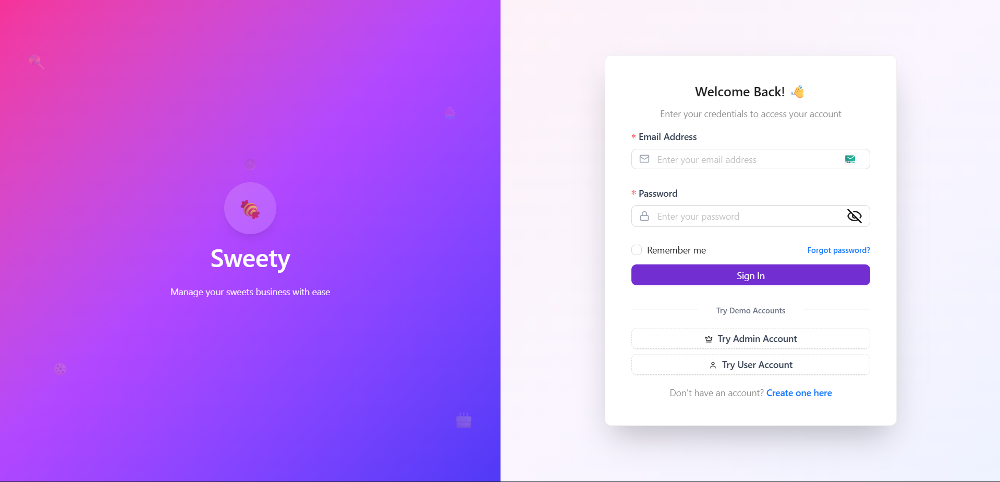
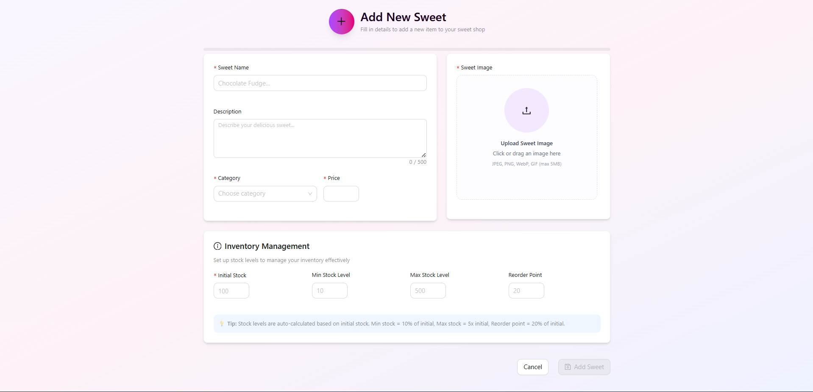
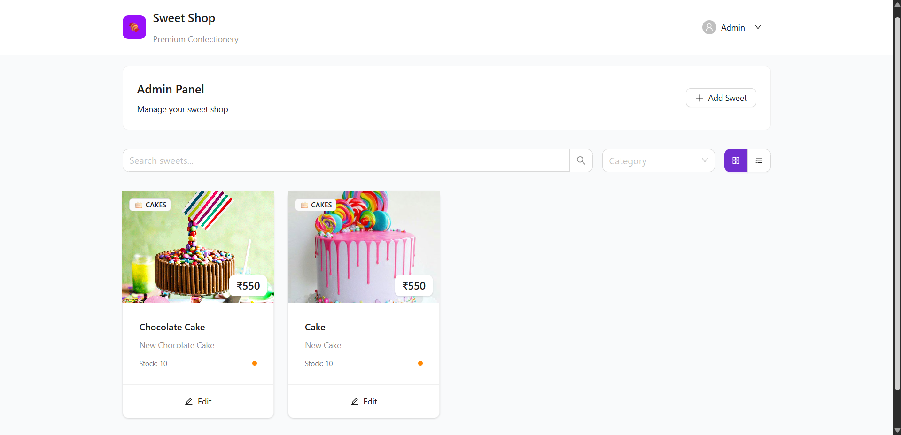
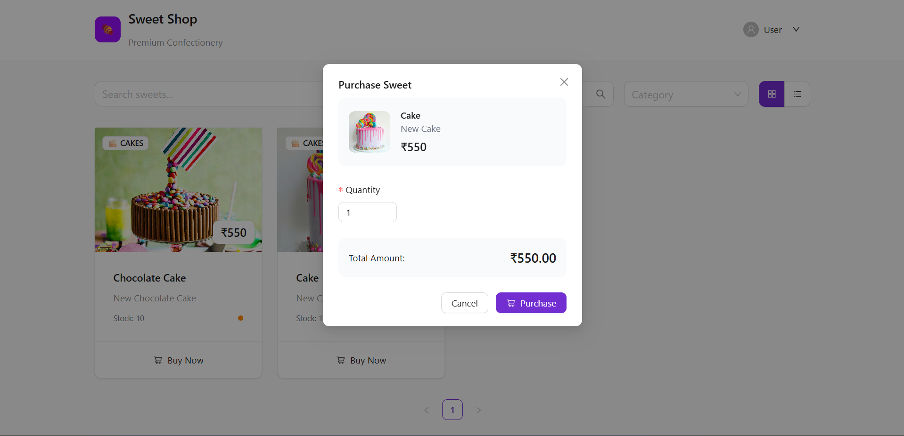

# 🍬 Sweet Shop Management System

A **Full-Stack TDD Kata Project** built to manage a modern sweet shop — enabling users to **add**, **view**, **search**, **purchase**, and **manage inventory** with **authentication** and **role-based access**.

> 🚀 **Coming Live Soon on Azure!**

---

## 🧠 Overview

The **Sweet Shop Management System** is designed using **Test-Driven Development (TDD)** principles to ensure robust, maintainable, and scalable code.  
It features a **RESTful backend**, **modern frontend**, **secure authentication**, and **real-time inventory management**.

---

## 🧱 Tech Stack

### 🧠 Backend
- **Node.js** + **Express** (TypeScript)
- **Prisma ORM** with **PostgreSQL**
- **JWT Authentication**
- **Cloudinary** for image uploads

### 💻 Frontend
- **React.js** (SPA)
- **Axios** for API calls
- **Tailwind CSS** for responsive design

### 🧪 Testing
- **Jest** + **Supertest** for TDD
- **React Testing Library** for UI tests

---

## ⚙️ Features

- 🔐 **Authentication** (Register/Login with JWT)
- 👥 **Role-based Access** (Admin/User)
- 🍰 **Sweet Management** (CRUD operations)
- 📦 **Inventory Control** (Initial Stock, Min/Max Levels, Reorder Points)
- 🔍 **Search & Filter** (By name, category, or price)
- 🛒 **Purchase Flow** (Auto stock deduction)
- 📸 **Image Uploads** (Cloudinary)
- 🧠 **Responsive Dashboard UI**

---

## 🧪 TDD Approach

This project follows **Red → Green → Refactor** workflow:
- Write failing tests before implementation
- Implement functionality to pass tests
- Refactor for performance and readability


## Cloning Reposiitory
```
git clone [https://github.com/yourusername/sweet-shop.git](https://github.com/ayushman075/sweety)
cd sweety
```
### Setup Backend
```
cd backend
npm install

```

### .env
```
DATABASE_URL=""
TEST_DATABASE_URL=""

JWT_SECRET=""
JWT_EXPIRES_IN=""
JWT_REFRESH_SECRET=""
JWT_REFRESH_EXPIRES_IN=""

REDIS_URL = ""
REDIS_PORT = ""

PORT=3000
NODE_ENV=""

CORS_ORIGIN="http://localhost:5173"

RATE_LIMIT_WINDOW_MS=""
RATE_LIMIT_MAX=""

CLOUDINARY_CLOUD_NAME=""
CLOUDINARY_API_KEY=""
CLOULINARY_SECRET_KEY=""
```

### Apply Prisma migrations
```
npx prisma migrate dev
npx prisma db seed
```
### Start Backend Server
```
Start backend server
```

## 📸 Screenshots

### 🧁 Kick In


### 🧁 Add New Sweet


### 🍰 Sweet Dashboard


### 🍰 Sweet Purchase


---

## 🧠 My AI Usage

To enhance productivity and maintain high code quality, I leveraged **AI tools** during development.

### 🧰 Tools Used
- 🤖 **ChatGPT (GPT-5)** – for architecture planning, code snippets, and documentation  
- ⚡ **GitHub Copilot** – for inline suggestions and boilerplate generation

### 💡 How AI Helped
- Generated initial structure for **REST APIs** and **Prisma schema**  
- Suggested **test cases** for TDD  
- Assisted in writing **clean, readable documentation**

### 🔍 Reflection
AI tools accelerated development, allowing me to focus on **logic**, **TDD**, and **UX**, ensuring **maintainable** and **production-ready** code.

